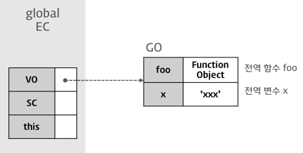
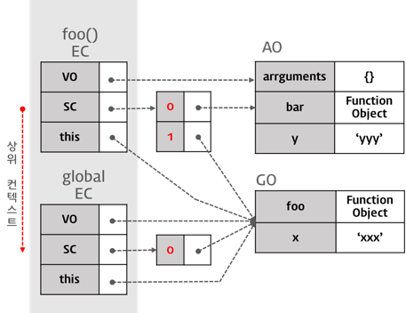

# 자바스크립트 실행컨텍스트(Execution Context)

## 자바스크립트 실행 컨텍스트란?
ECMAScript 에서는 실행컨텍스트를 다음과 같이 정의 하였다.
> 실행 가능한 코드를 형상화하고 구분하는 추상적인 개념

좀더 쉽게 말하면, 실행컨텍스트는 실행 컨텍스트는 실행 가능한 코드가 실행되기 위해 필요한 환경이라고할 수 있다.

자바스크립트 엔진은 코드를 실행하기 위해서 필요한 정보들을 알고 있어야한다. 변수와 변수의 유효범위, this 같은정보들을 말한다.
어떤 실행 컨텍스트가 활성화 될때, 자바스크립트 엔진은 해당 컨텍스트의 코드를 실행하는데 필요한 정보들을 수집해서 실행 컨텍스트에 저장한다. 

### 실행 컨텍스트의 구성요소
- 전역 코드 : 전역 영역에 존재하는 코드
- Eval 코드 : eval 함수로 실행되는 코드
- 함수 코드 : 함수 내에 존재하는 코드

## 실행 컨텍스트의 3가지 객체

실행 컨텍스트는 실행 가능한 코드를 형상화 하고 구분하는 추상적인 개념이지만 물리적으로 객체의 형태를 띄며 3가지 프로퍼티를 소유하고있다.

### Variable Object(변수 객체)

변수 객체는 다음의 정보를 가진다.
- 변수
- 매개변수와 인수 정보
- 함수 선언

Variable Object는 실행컨텍스트의 프로퍼티이다. 

다음은 전역 객체의 예이다.

### Scope Chain(SC)

스코프 체인의 경우 현재의 컨텍스트부터 전역 컨텍스트까지 리스트의 형태로 스코프의 레퍼런스를 저장한다.

### this

this 프로퍼티는 this 값이 할당된다. this에 할당되는 값은 함수 호출 패턴에 의해 결정된다.

